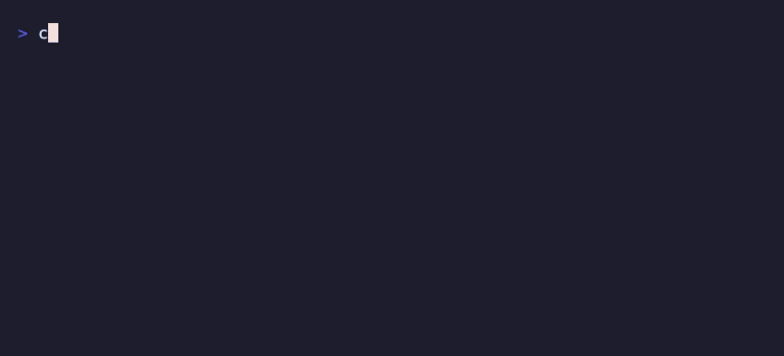
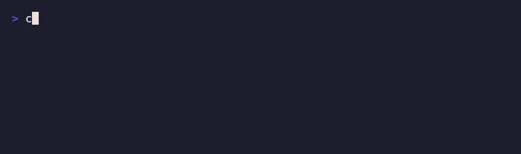

# @korkje/claudes

[](https://www.npmjs.com/package/@korkje/claudes)

Multi-account launcher for [Claude Code](https://claude.com/claude-code). Keeps any number of independent Claude Code configurations (accounts, settings, history) in `~/.claude-<name>` folders and launches `claude` with `CLAUDE_CONFIG_DIR` pointing at the one you pick.



## Install

```sh
npm install -g @korkje/claudes
```

Requires `claude` on your PATH.

## Usage

```sh
claudes            # interactive UI
claudes -- -r      # interactive UI, passing -r through to claude on launch
```

Everything is managed from the interactive UI:

| Key | Action |
| --- | --- |
| `↑`/`↓` or `j`/`k` | move |
| `enter` | launch the selected account; on `+ new account` / `+ add path` rows it opens an inline input (`enter` applies, `esc` cancels) |
| `d` | delete account (asks for confirmation), or a base path mapping |
| `p` | show/hide the account's base paths |
| `esc` | back — quits from the account list |

Your regular `~/.claude` appears as `default (~/.claude)` — listed first (when the folder exists) and impossible to delete. The list preselects the base path match for your working directory, or else the top entry.

On startup the UI checks npm for a newer claudes release in the background and shows a one-line notice when there is one; the check never blocks and failures (e.g. offline) are silent.

## Base paths

Base paths map directories to accounts: starting `claudes` inside a mapped directory preselects that account (longest match wins) and auto-launches it after a short countdown — navigating or using a shortcut cancels (unbound keys are ignored).

They're managed inline: press `p` on an account to expand its paths as an indented list below it (press again to collapse). `d` on a path removes the mapping, and the indented `+ add path` row turns into an input right in the list (prefilled with your cwd) that maps a new directory to that account.


## Replacing `claude`

To route plain `claude` through claudes, press `a` in the UI — an interactive toggle that adds/removes the alias in the startup file of your shell (zsh, bash, or fish).



It's equivalent to adding this to your `.zshrc`/`.bashrc` yourself:

```sh
alias claude="claudes --"
```

`claude`, `claude -r`, `claude --model opus`, etc. all open the UI, and any arguments are passed through to `claude` when an account launches — so `claude -r` inside a mapped directory shows the selector for a moment, then resumes with the right account (or immediately, with `enter`). Since aliases only exist in your interactive shell, IDE integrations and scripts that spawn `claude` still get the real CLI (as does claudes itself — no recursion). For claudes' own help/version, call the unaliased `claudes -h`.

## Non-interactive use

When stdin is not a TTY (pipes, scripts), `claudes` skips the UI and auto-resolves the account (base path match → default), passing any arguments through.

## Development

`npm test` builds the CLI and runs the vitest suite: unit tests for the config/account/shell logic, Ink component tests that drive the real UI through a fake terminal, and CLI tests against the built bundle with a stubbed `claude`.

The README demos are scripted with [VHS](https://github.com/charmbracelet/vhs): `npm run demo` regenerates all three GIFs inside throwaway HOMEs, so they never touch real accounts. The claude that "launches" at the end of the main demo is `demo/fake-claude.tsx`, a stand-in Ink screen.

## Config

Base path mappings live in `~/.claudes.json`:

```json
{
  "basePaths": {
    "~/Documents/dev/personal": "personal"
  }
}
```
